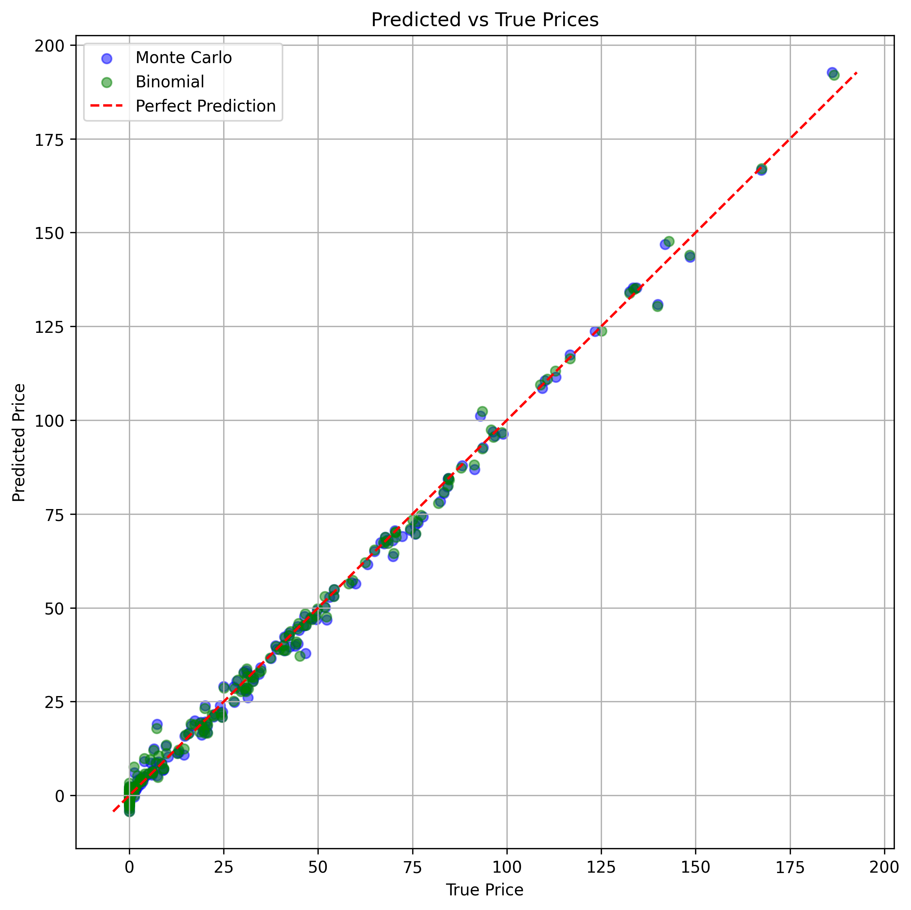
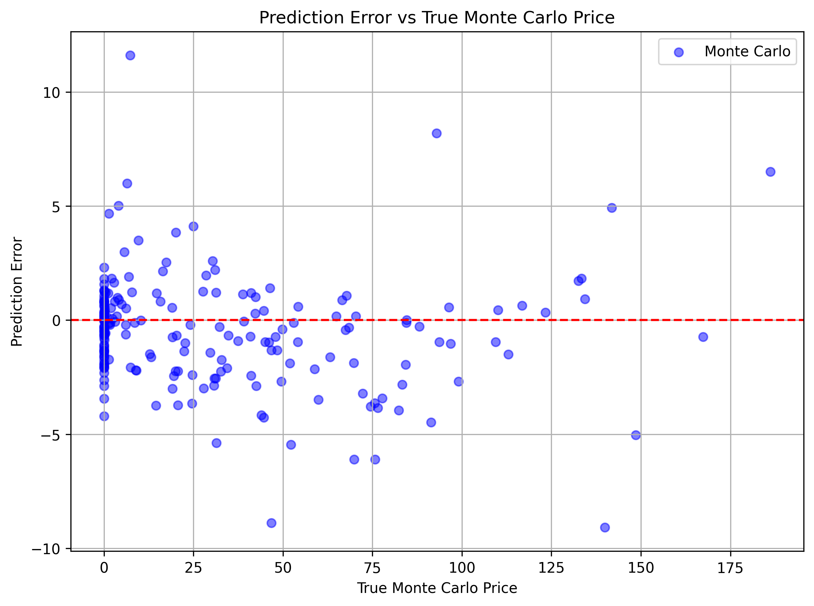
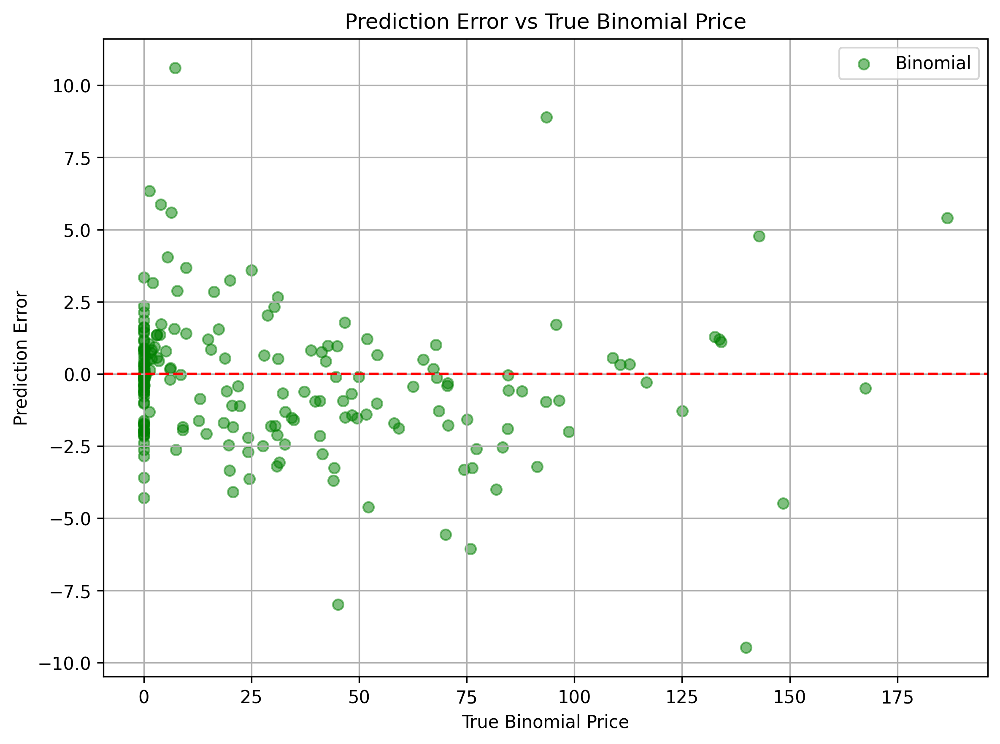

# Deep Learning Option Pricer

This project is a deep learning pricer for European Call Options. I wanted to see if a neural network could produce good results when compared to Quantlib's Monte Carlo and Binomial Tree Options Pricers. While those methods are extremly fascinating, (Monte Carlo in particular is quite fun to play around with), they are quite computationally expensive. 

# Implementation
- Generated 1000 synthetic uniformly sampled data for spot, strike, volatility, time to maturity, risk free interest rate, and dividend yield, then use QuantLib to generate prices using both Monte Carlo Simulation and Binomial Tree. These prices will be the labels.
- Train the model, optimized using ADAM.
- Test the model, then measure distance from prices predicted by MC and Binomial Tree
- Analyze speed difference between my neural network and the Quantlib methods.

# Results
- Overall I'm quite pleased with the results.
- As expected, the speed increase was most pronounced when compared with Monte Carlo Simulation, with my neural network pricing European calls 388258.28x faster. When compared to Binomial Tree, my neural network was still 285.16x faster.
- On average, my model priced options within $2.50 of the price generated by MC and Binomial Tree. I hope to improve on this with a larger dataset.
- GRAPHS:   

# Future Work
I'm happy with how this project turned out, but here are the next steps I'd like to take:
- Obviously this wasn't exactly a fair fight as far as the speed comparisons, so I'd like to create my own Monte Carlo and Binomial Tree pricers and use those to benchmark instead. In that vein, I'd like to try using the Black-Scholes analytical solution and numerical solution as the ground truth for my model.
- I'd like to expand this to pricing American and even Asian options
- Now that I've applied supervised learning to option pricing, the logical next step is try unsupervised learning. The most common method that I'm aware of using unsupervised learning is applying Neural Networks as Partial Differential Equation solvers. This sounds incredibly interesting, but I'll have to do some brushing up on the underlying mathematics first.
